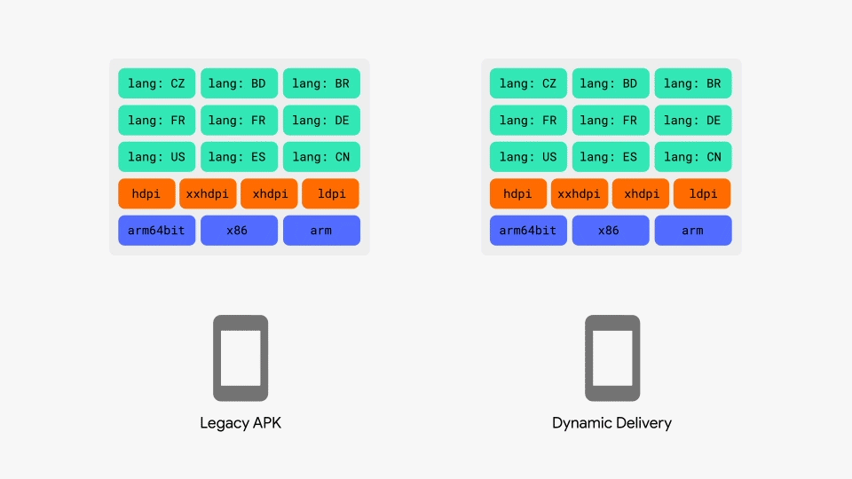
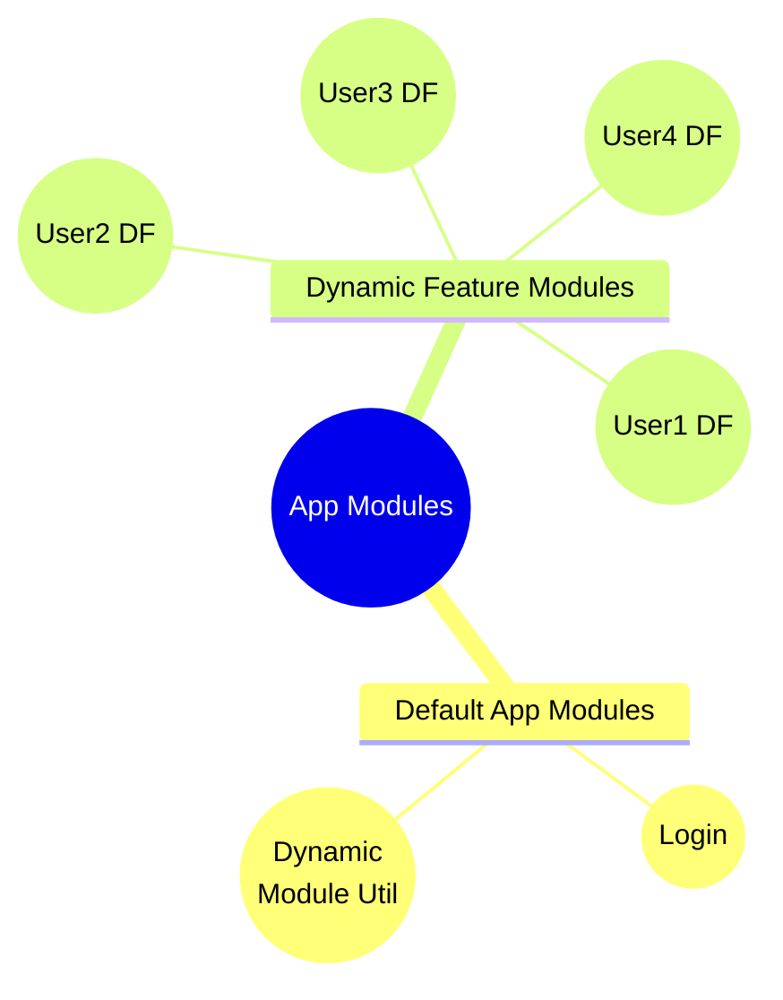
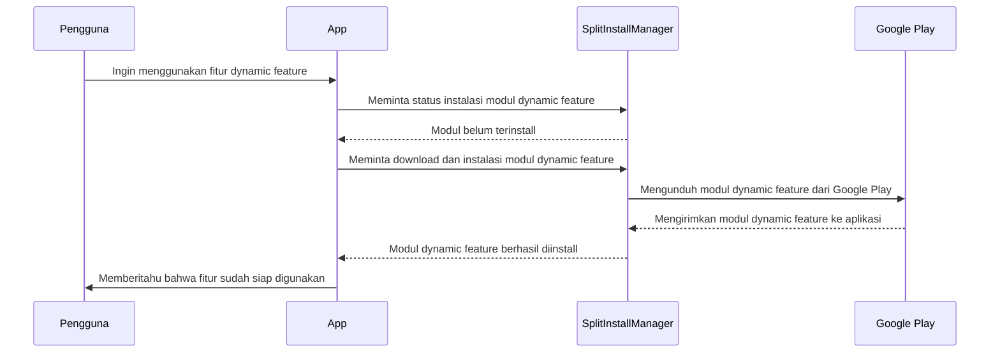

## Gambaran Projek

Projek ini dibuat untuk menguji dynamic feature pada Android Studio, terdapat 5 feature dummy untuk user1 hingga user5. user login dengan email user1, user2, user3, user4, dan user5. Setiap user memiliki dynamic feature masing-masing yang dapat diinstall secara on-demand. Setiap feature memiliki drawable gambar berukuran besar yang bertujuan untuk mengsimulasikan ukuran module yang besar.

## Dynamic Feature
Dynamic feature adalah fitur yang membuat user hanya menginstall fitur yang akan mereka butuhkan saja, sehingga dapat mengurangi ukuran APK saat pertama kali diinstall.



## Cara Kerja Dynamic Feature
1. Memisahkan fitur dynamic agar tidak diinstall secara default pada aplikasi (bila delivery on-demand)

2. Pada saat user ingin menggunakan fitur yang ada di dynamic feature, aplikasi akan menginstall modul dynamic feature tersebut secara on-demand



## Cara Membuat Dynamic Feature 

1. Create a new module
   
2. Pick Dynamic Feature Module
   
3. Create module title and pick install time
   
   install time dapat diganti di AndroidManifest milik dynamic feature
   
   
4. Gunakan SplitInstallManager untuk menginstall modul dynamic feature, dapat dilihat di bagian berikut
   [Contoh Penggunaan SplitInstallManager](https://github.com/kamalMakarim/testing-dynamic-feature/blob/main/TestingDynamicModule/app/src/main/java/com/kamal/testingdynamicmodule/dynamic_module/DynamicModuleDownloadUtil.kt)

## Hal-hal yang perlu diperhatikan

1. Ketika menggunakan dynamic feature, fitur dynamic tidak bisa di import langsung di app, perlu menggunakan reflection
2. Jika terdapat asset yang diakses oleh dua atau lebih dynamic feature, disarankan untuk meletakkan asset tersebut di base module untuk menghindari duplikasi asset
3. Jika ingin mengakses asset dari dynamic feature, pastikan nama file asset berbeda untuk menghindari konflik

---

## Pembuatan perbandingan ukuran APK

### Dynamic Feature

1. Memasukan/menghilangkan dynamic feature dari build universal dengan mengganti android manifest dari dynamic feature

```
<dist:fusing dist:include="false" />
```

true untuk memasukan, false untuk menghilangkan

2. Menggunakan bundletool untuk membuat apks dari aab

```
./gradlew bundleRelease
java -jar bundletool-all-1.18.1.jar build-apks --bundle=app/build/outputs/bundle/release/app-release.aab --output=<file name>.apks --mode=universal
```

### No Dynamic Feature

1. memasukan/menghilakan module dengan menghapus module dari build.gradle milik app nya sendiri

```
    implementation(project(":user1"))
    implementation(project(":user2"))
    implementation(project(":user3"))
    implementation(project(":user4"))
    implementation(project(":user5"))
```

2. Menggunakan bundletool untuk membuat apks dari aab

```
./gradlew bundleRelease
java -jar bundletool-all-1.18.1.jar build-apks --bundle=app/build/outputs/bundle/release/app-release.aab --output=<file name>.apks --mode=universal
```

---

## Perbandingan ukuran APK

| Module             | 0 module | 1 module | 1-2 module | 1-3 module | 1-4 module | 1-5 module |
| ------------------ | -------- | -------- | ---------- | ---------- | ---------- | ---------- |
| Dynamic Feature    | 7.07 MB  | 41.17 MB | 75.26 MB   | 109.36 MB  | 143.45 MB  | 177.55 MB  |
| No Dynamic Feature | 5.63 MB  | 39.72 MB | 73.81 MB   | 107.90 MB  | 141.99 MB  | 176.08 MB  |
| Difference         | 1.44 MB  | 1.45 MB  | 1.45 MB    | 1.46 MB    | 1.46 MB    | 1.47 MB    |

apk yang dihasilkan dapat dilihat di [releases](https://drive.google.com/drive/folders/113oJK7SlN4p1fVnZPW1TXPq6EEAMdrds?usp=sharing)