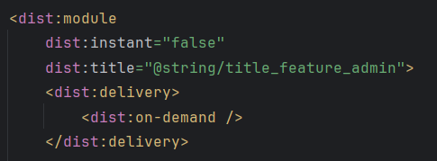
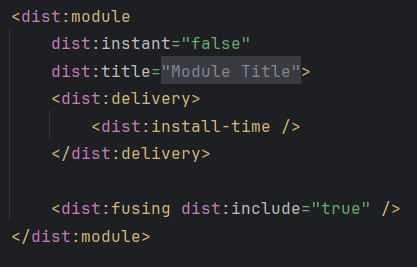
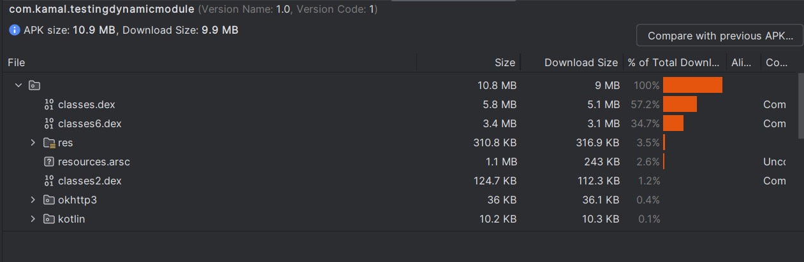
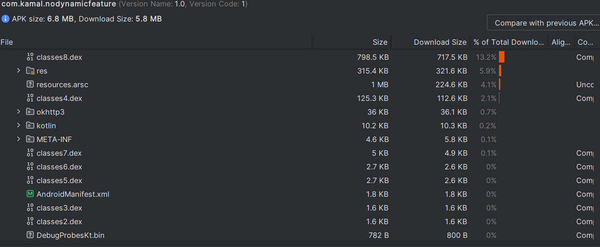

## Explanation about the project

Dalam projek ini terdapat login activity yang menentukan feature yang diperlukan oleh user, jika dia admin maka akan mendownload admin_feature, sementara bila user biasa maka akan mendownload user_feature. untuk menjalankan backend yang digunakan dapat ke direktori /demo-backend lalu menjalankan perintah

```
npm install
npm run start
```

Terdapat dua email dan password yang dapat digunakan untuk login, yaitu

1. (user) kamal.makarim@gmail.com:Password1234
2. (admin) admin@gmail.com:Password1234

## How To Make A Dynamic Feature On Android Studio

1. Create a new module
   
2. Pick Dynamic Feature Module
   
3. Create module title and pick install time
   
   install time dapat diganti di AndroidManifest milik dynamic feature
   
   
4. Gunakan SplitInstallManager untuk menginstall modul dynamic feature, dapat dilihat di bagian berikut
   [Contoh Penggunaan SplitInstallManager](https://github.com/kamalMakarim/testing-dynamic-feature/blob/main/TestingDynamicModule/app/src/main/java/com/kamal/testingdynamicmodule/dynamic_module/DynamicModuleDownloadUtil.kt)

## Things To Look Out For

1. Ketika menggunakan dynamic feature, fitur dynamic tidak bisa di import langsung di app, perlu menggunakan reflection
2. Jika terdapat asset yang diakses oleh dua atau lebih dynamic feature, disarankan untuk meletakkan asset tersebut di base module untuk menghindari duplikasi asset
3. Jika ingin mengakses asset dari dynamic feature, gunakan AssetManager untuk mengakses asset tersebut

## Internal Storage Used Comparison

| With Dynamic Feature | Without Dummy Image | Download Size with dummy image |
| -------------------- | ------------------- | ------------------------------ |
| False                | 5.8MB               | 47.1MB                         |
| True                 | 9.9MB               | 9.9MB                          |

## Build Analysis

### With Dynamic Feature



### Without Dynamic Feature


