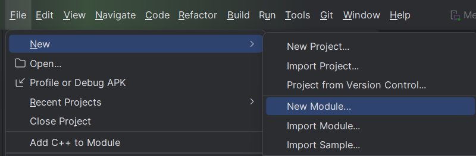
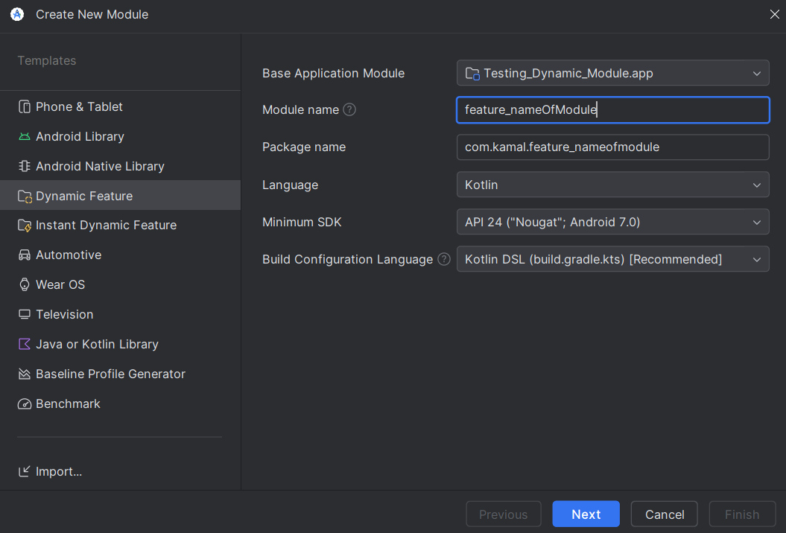
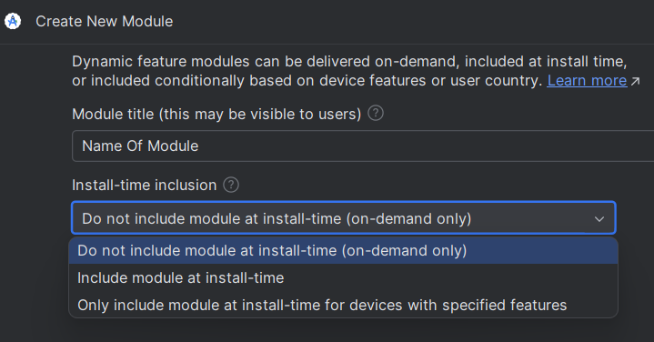

## Explanation about the project
Dalam projek ini terdapat login activity yang menentukan feature yang diperlukan oleh user, jika dia admin maka akan mendownload admin_feature, sementara bila user biasa maka akan mendownload user_feature. untuk menjalankan backend yang digunakan dapat ke direktori /demo-backend lalu menjalankan perintah
```
npm install
npm run start
```

## How To Make A Dynamic Feature On Android Studio

1. Create a new module
   
2. Pick Dynamic Feature Module
   
3. Create module title and install time
   
   Untuk on-demand-only memerlukan aplikasi yang sudah di upload ke playstore
4. Gunakan SplitInstallManager untuk menginstall dynamic feature

```kotlin
package com.kamal.testingdynamicmodule.dynamic_module

import android.content.Context
import android.util.Log
import com.google.android.play.core.splitinstall.SplitInstallException
import com.google.android.play.core.splitinstall.SplitInstallManager
import com.google.android.play.core.splitinstall.SplitInstallManagerFactory
import com.google.android.play.core.splitinstall.SplitInstallRequest
import com.google.android.play.core.splitinstall.SplitInstallSessionState
import com.google.android.play.core.splitinstall.SplitInstallStateUpdatedListener
import com.google.android.play.core.splitinstall.model.SplitInstallErrorCode
import com.google.android.play.core.splitinstall.model.SplitInstallSessionStatus

const val TAG = "dynamic_module_util"

class DynamicModuleDownloadUtil(context: Context, private val callback: DynamicDeliveryCallback) {

    private lateinit var splitInstallManager: SplitInstallManager
    private var mySessionId = 0

    init {
        if (!::splitInstallManager.isInitialized) {
            splitInstallManager = SplitInstallManagerFactory.create(context)
        }
    }

    fun isModuleDownloaded(moduleName: String): Boolean {
        return splitInstallManager.installedModules.contains(moduleName)
    }

    fun downloadDynamicModule(moduleName: String) {
        val request = SplitInstallRequest.newBuilder()
            .addModule(moduleName)
            .build()

        val listener = SplitInstallStateUpdatedListener { state -> handleInstallStates(state) }
        splitInstallManager.registerListener(listener)

        splitInstallManager.startInstall(request)
            .addOnSuccessListener { sessionId ->
                mySessionId = sessionId
            }
            .addOnFailureListener { e ->
                Log.d(TAG, "Exception: $e")
                handleInstallFailure((e as SplitInstallException).errorCode)
            }

        splitInstallManager.unregisterListener(listener)
    }

    private fun handleInstallFailure(errorCode: Int) {
        when (errorCode) {
            SplitInstallErrorCode.NETWORK_ERROR -> {
                callback.onFailed("No internet found")
            }

            SplitInstallErrorCode.MODULE_UNAVAILABLE -> {
                callback.onFailed("Module unavailable")
            }

            SplitInstallErrorCode.ACTIVE_SESSIONS_LIMIT_EXCEEDED -> {
                callback.onFailed("Active session limit exceeded")
            }

            SplitInstallErrorCode.INSUFFICIENT_STORAGE -> {
                callback.onFailed("Insufficient storage")
            }

            SplitInstallErrorCode.PLAY_STORE_NOT_FOUND -> {
                callback.onFailed("Google Play Store Not Found!")
            }

            else -> {
                callback.onFailed("Something went wrong! Try again later")
            }
        }
    }

    private fun handleInstallStates(state: SplitInstallSessionState) {
        if (state.sessionId() == mySessionId) {
            when (state.status()) {
                SplitInstallSessionStatus.DOWNLOADING -> {
                    callback.onDownloading()
                }

                SplitInstallSessionStatus.DOWNLOADED -> {
                    callback.onDownloadCompleted()
                }

                SplitInstallSessionStatus.INSTALLED -> {
                    Log.d(TAG, "Dynamic Module downloaded")
                    callback.onInstallSuccess()
                }

                SplitInstallSessionStatus.FAILED -> {
                    callback.onFailed("Installation failed")
                }

                SplitInstallSessionStatus.CANCELED -> {
                    callback.onFailed("Installation Cancelled")
                }
            }
        }
    }

}
```
